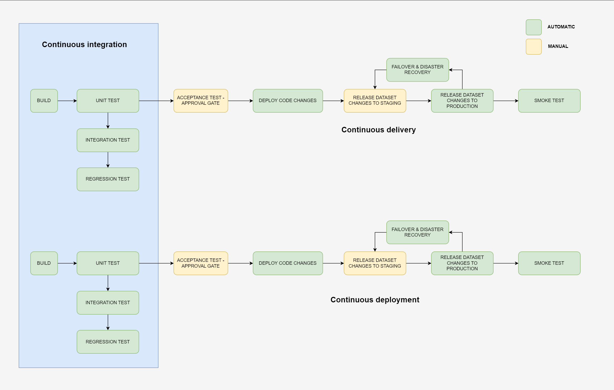

Defining CI/CD Strategies for data release with dbt & Snowflake
===============================================================

In this page:

/\*<!\[CDATA\[\*/ div.rbtoc1694350117516 {padding: 0px;} div.rbtoc1694350117516 ul {list-style: disc;margin-left: 0px;} div.rbtoc1694350117516 li {margin-left: 0px;padding-left: 0px;} /\*\]\]>\*/

*   [Principles](Defining-CI_CD-Strategies-for-data-release-with-dbt-&-Snowflake.950380.html#DefiningCI/CDStrategiesfordatareleasewithdbt&Snowflake-Principles)
*   [A comprehensive picture of Continuous Integration, Continuous Delivery and Continuous Deployment in Data Modelling](Defining-CI_CD-Strategies-for-data-release-with-dbt-&-Snowflake.950380.html#DefiningCI/CDStrategiesfordatareleasewithdbt&Snowflake-AcomprehensivepictureofContinuousIntegration,ContinuousDeliveryandContinuousDeploymentinDataModelling)
    *   [Branching Strategy](Defining-CI_CD-Strategies-for-data-release-with-dbt-&-Snowflake.950380.html#DefiningCI/CDStrategiesfordatareleasewithdbt&Snowflake-BranchingStrategy)
    *   [Continuous Integration](Defining-CI_CD-Strategies-for-data-release-with-dbt-&-Snowflake.950380.html#DefiningCI/CDStrategiesfordatareleasewithdbt&Snowflake-ContinuousIntegration)
        *   [Automatic Build](Defining-CI_CD-Strategies-for-data-release-with-dbt-&-Snowflake.950380.html#DefiningCI/CDStrategiesfordatareleasewithdbt&Snowflake-AutomaticBuild)
        *   [Unit Tests](Defining-CI_CD-Strategies-for-data-release-with-dbt-&-Snowflake.950380.html#DefiningCI/CDStrategiesfordatareleasewithdbt&Snowflake-UnitTests)
        *   [Integration Tests P2](Defining-CI_CD-Strategies-for-data-release-with-dbt-&-Snowflake.950380.html#DefiningCI/CDStrategiesfordatareleasewithdbt&Snowflake-IntegrationTestsP2)
        *   [Regression Tests](Defining-CI_CD-Strategies-for-data-release-with-dbt-&-Snowflake.950380.html#DefiningCI/CDStrategiesfordatareleasewithdbt&Snowflake-RegressionTests)
    *   [CD Strategy - Continuous Deployment vs Continuous Delivery with Clones](Defining-CI_CD-Strategies-for-data-release-with-dbt-&-Snowflake.950380.html#DefiningCI/CDStrategiesfordatareleasewithdbt&Snowflake-CDStrategy-ContinuousDeploymentvsContinuousDeliverywithClones)
        *   [Deploy Code Changes](Defining-CI_CD-Strategies-for-data-release-with-dbt-&-Snowflake.950380.html#DefiningCI/CDStrategiesfordatareleasewithdbt&Snowflake-DeployCodeChanges)
        *   [Release Dataset Changes](Defining-CI_CD-Strategies-for-data-release-with-dbt-&-Snowflake.950380.html#DefiningCI/CDStrategiesfordatareleasewithdbt&Snowflake-ReleaseDatasetChanges)
            *   [Failure and Disaster Delivery with Blue Green Deployment Strategy](Defining-CI_CD-Strategies-for-data-release-with-dbt-&-Snowflake.950380.html#DefiningCI/CDStrategiesfordatareleasewithdbt&Snowflake-FailureandDisasterDeliverywithBlueGreenDeploymentStrategy)
            *   [Continuous Delivery with Manual Deployment Gate](Defining-CI_CD-Strategies-for-data-release-with-dbt-&-Snowflake.950380.html#DefiningCI/CDStrategiesfordatareleasewithdbt&Snowflake-ContinuousDeliverywithManualDeploymentGate)
            *   [Or, Continuous Deployment](Defining-CI_CD-Strategies-for-data-release-with-dbt-&-Snowflake.950380.html#DefiningCI/CDStrategiesfordatareleasewithdbt&Snowflake-Or,ContinuousDeployment)
        *   [Smoke Tests](Defining-CI_CD-Strategies-for-data-release-with-dbt-&-Snowflake.950380.html#DefiningCI/CDStrategiesfordatareleasewithdbt&Snowflake-SmokeTests)
        *   [Switching Traffic](Defining-CI_CD-Strategies-for-data-release-with-dbt-&-Snowflake.950380.html#DefiningCI/CDStrategiesfordatareleasewithdbt&Snowflake-SwitchingTraffic)
        *   [Post-Release](Defining-CI_CD-Strategies-for-data-release-with-dbt-&-Snowflake.950380.html#DefiningCI/CDStrategiesfordatareleasewithdbt&Snowflake-Post-Release)
*   [CICD patterns](Defining-CI_CD-Strategies-for-data-release-with-dbt-&-Snowflake.950380.html#DefiningCI/CDStrategiesfordatareleasewithdbt&Snowflake-CICDpatterns)
    *   [Feature Deployment](Defining-CI_CD-Strategies-for-data-release-with-dbt-&-Snowflake.950380.html#DefiningCI/CDStrategiesfordatareleasewithdbt&Snowflake-FeatureDeployment)
    *   [Hotfix/ Patches Deployment](Defining-CI_CD-Strategies-for-data-release-with-dbt-&-Snowflake.950380.html#DefiningCI/CDStrategiesfordatareleasewithdbt&Snowflake-Hotfix/PatchesDeployment)
    *   [Admin/ Configuration Deployment](Defining-CI_CD-Strategies-for-data-release-with-dbt-&-Snowflake.950380.html#DefiningCI/CDStrategiesfordatareleasewithdbt&Snowflake-Admin/ConfigurationDeployment)

Principles
==========

CI/CD designs can be summarized within 3 aspects:

*   **Environment Consistency**: Ensure that testing and staging environments mirror production as closely as possible to catch environment-specific issues.
    
*   **Automate**: Maximize automation at every step, from testing to deployment, to reduce manual errors and increase speed.
    
*   **Monitoring and Rollback**: Regardless of the use case, always monitor the application post-deployment and have a clear rollback strategy in case of issues.
    

Throughout the development lifecycle of a data product, while ensuring the quality and consistency are maintained across various use cases, CICD process should also be Agile and efficient, catering the unique needs and urgencies of each scenario.

A comprehensive picture of Continuous Integration, Continuous Delivery and Continuous Deployment in Data Modelling
==================================================================================================================

Branching Strategy
------------------

Use feature branches to isolate new feature development (develop/feature) and deployment (release/feature).

Continuous Integration
----------------------

CI is triggered by a PR from a release branch to base branch.

### Automatic Build

**Build Step**

Create a CI/TEST environment - a cloned environment of base environment.

Test all dependent upstream sources/models within the lineage of ‘new/modified’ models.

Run all dependent downstream models within the lineage of ‘new/modified’ models.

### Unit Tests

_\*Only new/modified models are considered_

dbt test: each model in isolation to ensure that the logic within the model produces expected results.

**Proposed Test**

**dbt Test Type**

**Description**

Column Value Tests

generic test macro: accepted\_values

*   Test specific values in the transformed data to ensure correctness.
    
*   Example: Assert that all prices in a `product` table are above 0.
    

Column Existence Tests

custom generic

*   Ensure that specific columns exist in the transformed model, especially after transformations.
    

Uniqueness Tests

generic test macro: unique

*   Ensure that a column (or set of columns) has unique values where expected.
    
*   Example: Assert that `user_id` in the `users` model is unique.
    

Not-Null Tests

generic test macro: not\_null

*   Ensure that specific columns don’t have null values where it's not expected.
    
*   Example: Assert that `email` column in the `users` model is not null
    

Custom Business Logic Tests

custom generic or singular test macro

*   All fundids are valid
    
*   Premium rate > 0
    

Data Comparison on (Selective) Models

custom data audit/reconciliation package

*   Compare the results of your transformed data before and after the changes.
    
*   Auto produce results as report. as an input for **Manual Approval Gate**
    
*   This might be computationally expensive on large models.
    

### Integration Tests P2

**Proposed Test**

**dbt Test Type**

**Description**

Referential Integrity Tests

generic test macro: relationships

*   Ensure that foreign keys in one table exist as primary keys in another table.
    

Source Freshness

generic macro: freshness

*   Ensure data in lineage flows is updated consistently
    

### Regression Tests

**Step**

**Description**

dbt test all on nodes

Regression tests ensure that new changes haven't negatively impacted existing models

Lineage Integrity Validation

If unexpected models are built in the test environment.

CD Strategy - Continuous Deployment vs Continuous Delivery with Clones
----------------------------------------------------------------------

### Deploy _Code Changes_

Pushing new or modified code to a code base environment. This might include changes to transformation logic, new data models, adjustments to data pipelines, or any other code-based alterations.

**Step**

**Description**

Code Review Approval

Require code review process or multiple levels of approvals, ideally by Data Product Tech Lead

User Acceptance Testing Approval

QA Team or Data Owner

Merge

Once having 2 signoffs above indicates it’s ready to ship. The release branch gets merged into the base branch.

Release Tag

Automatic tagging with a release version number preparing for the actual release of datasets

### Release _Dataset Changes_

Release process is started by a Merge from a release branch to a base branch.

Fully levering automation and Snowflake clone capabilities, every deployment is a clone operation over targeted datasets from an Approved/Tag Stage Environment to Base Environment

_The changes are now "live" and can impact end users, dashboards, reports, or any downstream data applications._

Each project, since the beginning, should be defined/ configured a CD approach for the release pipeline.

#### Failure and Disaster Delivery with Blue Green Deployment Strategy

Blue/Green (sometimes referred to as Red/Black) deployment is a strategy where two separate environments (blue and green) are maintained.

*   **Blue (Production) Environment**: This is the current production environment where the latest stable version of datasets resides and consumed by users/ applications.
    
*   **Green (Staging) Environment**: This is an exact clone of the Blue environment. Initially, it's an identical copy, but and where we'll SWITCH the current targeted objects from CLONES of all tested objects in the Staging Environment
    

#### Continuous Delivery with Manual Deployment Gate

schedule or manually trigger Blue Green Deployment

#### Or, Continuous Deployment

automatically trigger Blue Green Deployment on changes committed to base branch.

### Smoke Tests

**Step**

**Description**

dbt test all critical data models.

Ensure critical datasets (e.g. final consumable datasets) are as still as expected after deployment.

### Switching Traffic

If the release process succeeded, we start switching Blue ↔︎ Green environments by:

*   Wrapping RENAME DDL operations in an atomic transaction.
    

Renaming an object in Snowflake is generally a fast, metadata-only operation.

`BEGIN;`

`ALTER DATABASE <BLUE> RENAME TO BACKUP_<RELEASE_VERSION>_BLUE;`

`ALTER DATABASE <GREEN> RENAME TO <BLUE>;`

`COMMIT;`

*   Assign Database Time-To-Live in Archive?/Purge Metastore
    
*   Any error in the release process will kickoff:
    
    *   an automatic rollback to a previous, stable version of the code.
        
    *   switch Backup ↔︎ Blue in an atomic transaction
        

### Post-Release

**Step**

Notify relevant stakeholders on new successful release.

Update documentation

Cleaning up Staging Environment

CICD patterns
=============

Feature Deployment
------------------

<TODO>

Hotfix/ Patches Deployment
--------------------------

<TODO>

Admin/ Configuration Deployment
-------------------------------

<TODO>

[Defining DataOps practice as an enabler](Defining-DataOps-practice-as-an-enabler.1015980.html) [Provisioning environments for data products at scale with IaC](Provisioning-environments-for-data-products-at-scale-with-IaC.917668.html)